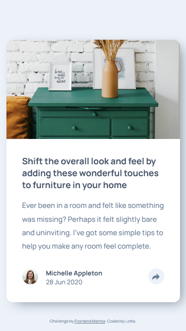

# Frontend Mentor - Article preview component solution

This is a solution to the [Article preview component challenge on Frontend Mentor](https://www.frontendmentor.io/challenges/article-preview-component-dYBN_pYFT). Frontend Mentor challenges help you improve your coding skills by building realistic projects.

## Table of contents

- [Overview](#overview)
  - [The challenge](#the-challenge)
  - [Screenshot](#screenshot)
- [My process](#my-process)
  - [Built with](#built-with)
  - [What I learned](#what-i-learned)
  - [Continued development](#continued-development)

## Overview

### The challenge

Users should be able to:

- View the optimal layout for the component depending on their device's screen size
- See the social media share links when they click the share icon

### Screenshot

## My process

### Built with

- Semantic HTML5 markup
- CSS custom properties
- CSS Grid
- Mobile-first workflow
- Javascript

### What I learned

I tried with this project to write a workflow-file. Just so that the future me know, where we started.

I used same logic with this than with a mobile nav would. I think it works kind of ok. I notised that the dark background element, that is in the desktop is not coming with the starter files. (I felt lazy and didn't do one on my own.)

### Continued development

I have to learn more about CSS animations. I think that the right animation can elevate this project.

Maybe some hover-effect could also look nice.
